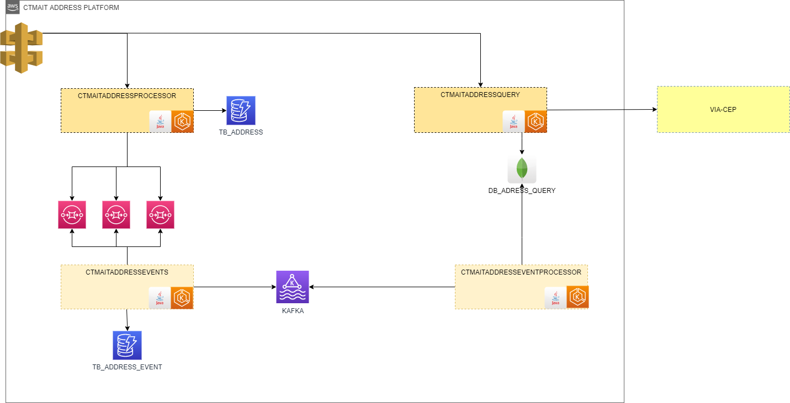

# <h1>ADDRESSPROCESSOR</h1>

Aplicação responsável por processar inclusão, alteração, exclusão, publicar os respectivos eventos para o event sourcing e a camada de query
da plataforma.

<h2>
Case de exemplo do Design Pattern DAT.
</h2>

<h3>
Padrão de projeto criado por Carly Oliveira
</h3>

<h3>
Stacks:
</h3>
 
Docker
 
Java 17
 
SpringBoot
 
SpringCloud
 
AWS - provido via localStack: AWS SQS, AWS DynamoDB
 
Lombok
 
MapStruct
 
Maven
 

<h3>Arquitetura da plataforma</h3>

<h4>
 Instruções para executar o projeto
</h4>
 
1 - Abra o cmd, execute ipconfig, copie o endereço ipv4 do adaptador ethernet e 
altere o endereço dos recursos acessados no application.yml
 
2 - Na pasta raiz do projeto executar: mvn clean install
 
3 - Na pasta recursos-embedded, execute o start-local-stack.sh para subir
a infra provendo os serviços da aws.
 
4 - Na pasta raiz do projeto gere a imagem: docker build  -t ctmaitaddressprocessor .
 
5 - Crie/execute o container com a imagem do projeto: docker run -e "SPRING_PROFILES_ACTIVE=local" --name ctmait-addressprocessor ctmaitaddressprocessor
 
6 - Import a collection no postman e execute os serviços.
 
7 - Acessar o banco: http://localhost:8001/
 
8 - Acessar todos os serviços provisionados na localstack: https://app.localstack.cloud
 
8.1 - Faça o login
 
8.2 - Click em "resources"
 
8.3 - Vai listar todos os serviços, o que provisionamos foi SQS e DynamoDB
 
8.4 - Acesse um dos serviços provisionados e verifique os dados gerados pela aplicação